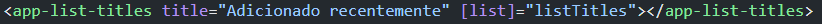

### Começando a aprender ANGULAR

## Angular

~~~javascript
npm install -g @angular/cli

ng new nomeDoProjeto

ng serve --open
// e vai estar em http://localhost:4200/
ng gerenate component caminho/NomeDoComponent 

// Declarar parametro em um componente : 

// Se o parametro do component estiver uma variável, voce tem que colocar o [] entre ele. 
~~~

~~~javascript

~~~

## TypeScript

~~~typescript
// É uma linguagem que tipa o JavaScript

// Para a tipagem de algo é necessário colocar o ":"
// Se voce nao colocar tipo na propriedade, ela será do tipo any.
// ideal sempre tipar as propriedades, parametros de métodos, retorno de métodos, etc.

~~~
